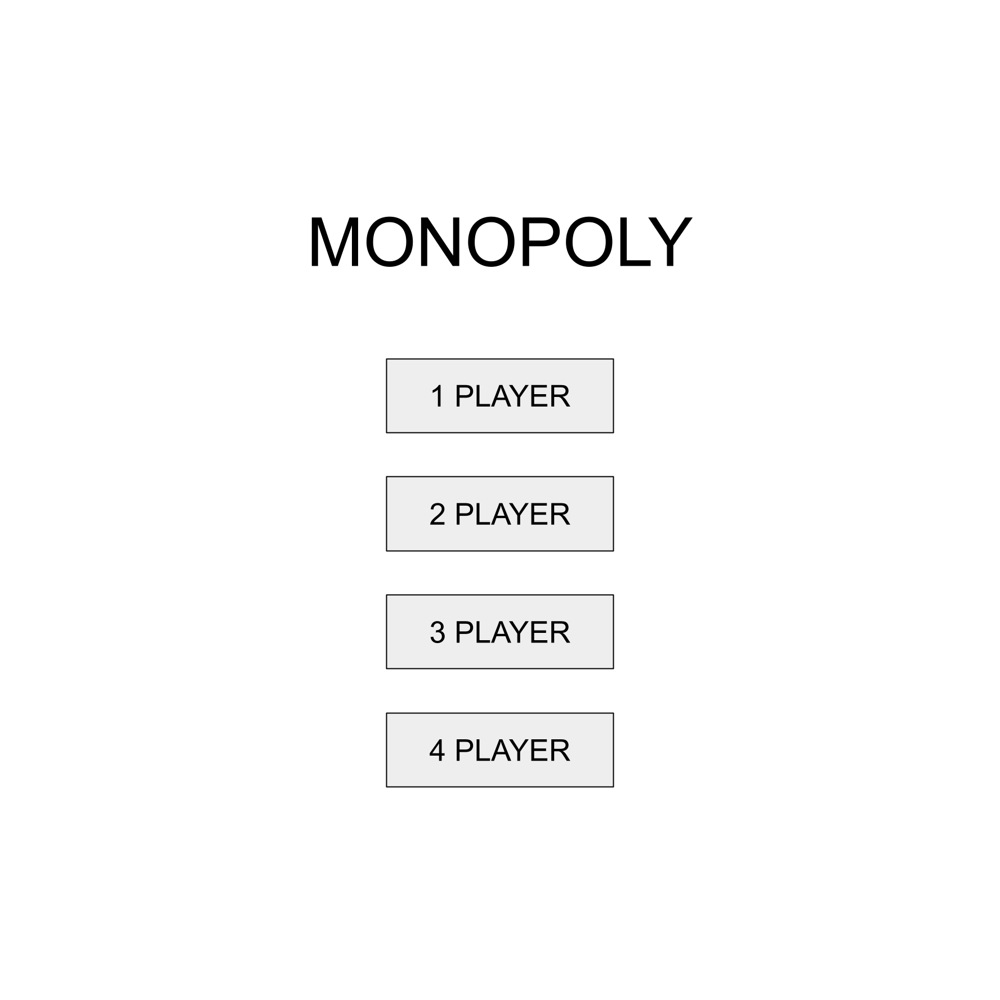
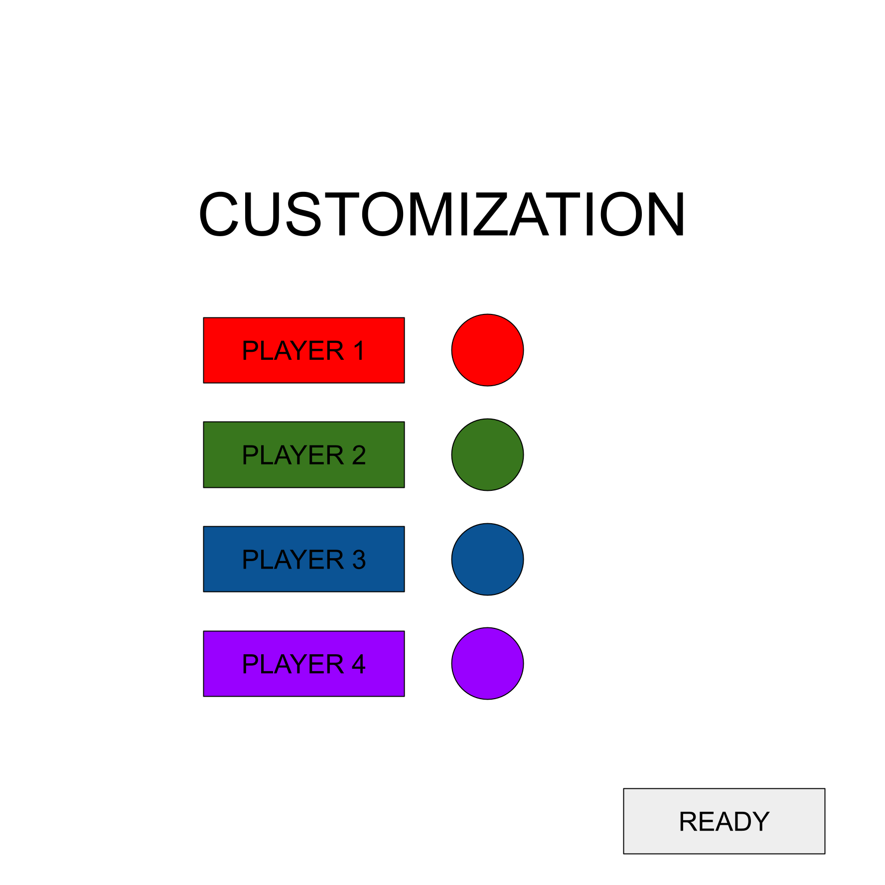
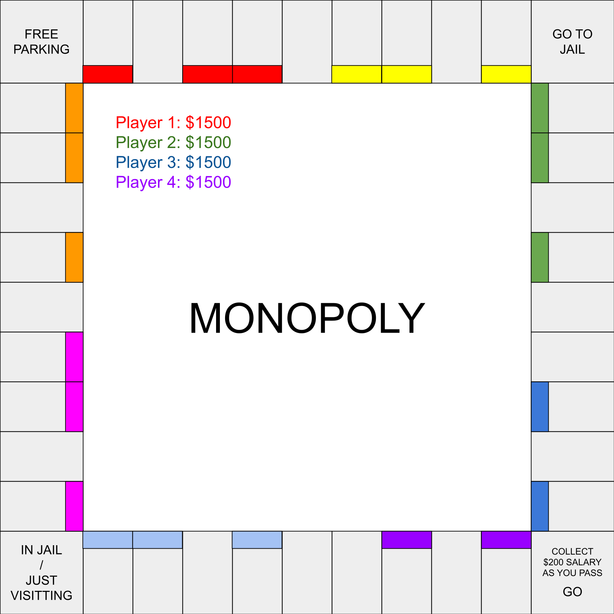
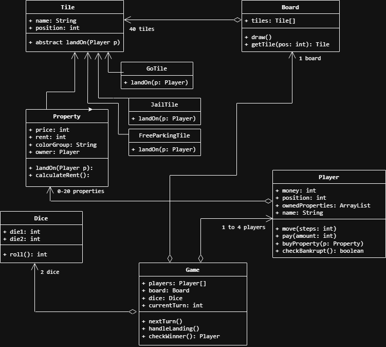

# Final Project Prototype

## Group Members:

Aidan Zeleniy and Ibrahim Attia

## Group Name:

**The Processing Capitalists**

## Brief Project Description:

We are creating a fully playable version of the board game Monopoly using Java and Processing. This project will allow two to four friends to play the game together on the same computer. We are building the entire game board from scratch and making sure all the classic rules work exactly as they do in real life. Players will take turns rolling dice, moving their tokens around the board, buying properties, and trying to bankrupt their opponents.

## Expanded Description:

**Critical features (MVP):**
* First, we will build the 40 spaces that make up the classic Monopoly board. We will arrange these spaces in a square around the edge of the game window so it looks just like the physical board.
* We will create a menu system where players can choose how many people are playing before the game starts.
* Once the game begins, we will have a working turn system. This means the game will know whose turn it is and will wait for that player to click a button to roll the dice.
* When a player rolls the dice, their token will move forward the correct number of spaces. If they pass the Go space, they will collect their starting bonus.
* We will include a way for players to buy unowned properties they land on. The game will show them the price and ask if they want to make the purchase.
* If another player lands on a property that is already owned, the game will automatically subtract the rent from their money and give it to the owner.
* We will have a section in the middle of the screen that always shows everyone's current money and whose turn it is.
* Finally, if a player runs out of money, they will be eliminated from the game entirely.    

**Nice to have features:**
* If we have extra time, we want to show the player tokens actually moving space by space along the board instead of just appearing at their new location.
* We will include option for one player game where the user plays against a bot making random moves.
* We want to add a fun visual effect for rolling the dice, making the numbers scramble on the screen before stopping.
* For the game rules, we want to add the ability to collect a full set of colors and build houses and hotels. This will make the game much more competitive because the rent will go up a lot.
* We also want to include all the rules for going to jail. This includes getting sent to jail, waiting three turns, and trying to roll doubles to get out early.
* Lastly, we want to make sure that when a player goes bankrupt, all their properties go back to being unowned so other people can buy them again.    

# Project Screen Images

**Start Screen**
 

**Customization Screen**
 

**Game Screen (Chance/rent/buying will be a popup)**
 

# Project Design and UML:
 

  
The <code>Game</code> class acts as the central part of the game mechanics as it holds references to the <code>Board</code>, both <code>Players</code> and the <code>Dice</code>. Each turn, <code>Game</code> calls <code>roll()</code> on the <code>Dice</code> and then calls <code>move()</code> on the current <code>Player</code> with the result. Once the <code>Player</code>'s position updates, <code>Game</code> calls <code>getTile()</code> on the <code>Board</code> to find out which <code>Tile</code> they landed on, then calls <code>landOn()</code> passing the <code>Player</code> in.

From there, the specific <code>Tile</code> subclass handles the logic. For example, if it's a <code>Property</code>, it checks if there's an owner and either prompts a purchase or calls <code>pay()</code> on the <code>Player</code> to transfer rent. After every transaction, <code>checkBankrupt()</code> is called on the <code>Player</code> to see if they've gone below $0, and if so <code>Game</code> eliminates them.

<code>Board</code> is purely responsible for storing the 40 <code>Tile</code> objects in order and rendering them visually, it holds no game logic itself.

# Development Stages / Pacing:

## Phase 1: Core Architecture and Basic Rendering
* **Objective:** Establish the main classes from the UML diagram and get a visual representation of the empty board on screen.
* **Tasks:**
    * Set up the Processing environment and initialize the GitHub repository.
    * Implement the abstract `Tile` class and its basic subclasses (`Property`, `GoTile`, `JailTile`, `FreeParkingTile`).
    * Create the `Board` class and initialize an array of 40 standard Monopoly tiles in the correct sequence.
    * Write the `draw()` method in the `Board` class to render the square track and individual tile outlines around the edge of the window.
* **Work Split Idea:** Ibrahim can work on setting up the `Tile` hierarchy and the initial object skeletons, while Aidan can handle the Processing coordinates and math required to draw the `Board` layout correctly.

  

## Phase 2: Player Entities and Basic Movement
* **Objective:** Create player objects that can roll dice and traverse the board indices.
* **Tasks:**
    * Create the `Player` class with attributes for money ($1500), position (index 0), and name.
    * Implement the `Dice` class with a `roll()` function returning a random value between 2 and 12.
    * Create the `Game` class to manage the array of `Player` objects and track `currentTurn`.
    * Implement basic movement logic where a dice roll updates a player's position index and loops back to 0 after index 39.
    * Render basic colored tokens on the board to represent players based on their current tile position.
* **Work Split Idea:** Aidan can build the `Dice` class and the visual rendering of the player tokens on the board. Ibrahim can implement the `Player` state management and the `Game` class turn loop.

  

## Phase 3: Interactions, Economy, and UI Screens
* **Objective:** Implement property purchasing, rent payments, pre-game setup menus, and the core gameplay loop.
* **Tasks:**
    * Implement the Start Screen UI with clickable areas for selecting 1 to 4 players.
        * 
    * Implement the Customization Screen UI to assign specific colors to players.
        * 
    * Program the `landOn()` logic inside the `Property` class to handle unowned (prompt purchase pop-up) and owned (automatically deduct rent) states.
    * Add logic to the `GoTile` class to add $200 to the player's balance when they land on or pass it.
    * Implement the `checkBankrupt()` method to eliminate players who drop below $0.
    * Create the on-screen text display showing all current player balances and whose turn it is.
        * !
* **Work Split Idea:** Aidan can handle the Start and Customization screens using Processing mouse click events to transition between game states. Ibrahim can implement the financial logic, ownership tracking, and bankruptcy elimination.

  

## Phase 4: Polish and "Nice to Have" Features
* **Objective:** Add advanced Monopoly rules, visual animations, and finalize the project.
* **Tasks:**
    * Implement jail mechanics (sending a player to index 10, restricting movement for 3 turns unless doubles are rolled).
    * Add logic to group properties by `colorGroup` to allow house/hotel upgrades and rent multipliers.
    * Add a system to return properties to an unowned state when a player goes bankrupt.
    * Animate the dice roll with a scrambling visual effect before settling on the final number.
    * Animate player token movement space by space along the board instead of instantly appearing at the destination.
    * Build a basic bot for the single-player mode that makes random purchasing decisions.
* **Work Split Idea:** Ibrahim can work on the rules for color groups, house building logic, and the bot decision algorithm. Aidan can focus on the visual polish, specifically the animations for the dice and the step-by-step movement.
