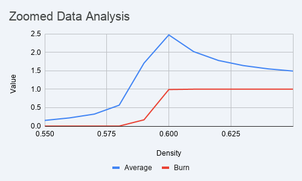

# APCS2-Lab08-TreeBurn

# BurnTrees Lab

## Explanations

### How I chose the zoomed-in range

The coarse table (densities 0.00–1.00 in steps of 0.05) showed normalized burn time rising sharply between 0.50 and 0.60, then dropping steadily from 0.60 onward. That made 0.55–0.65 the obvious window to look at. Running that range at 0.01 increments on the 1000×1000 board confirms a local maximum at density 0.60 (normalized burn time 2.470). The values on both sides are lower, so the peak is clearly on that density.

### Larger board vs smaller board

The 1000×1000 board produces smoother, more consistent results. With more cells per run, each repetition samples more of the forest, so averages stabilize across the 100 repetitions. The 100×100 board has noticeably higher variance. Its peak normalized burn time (2.589 at density 0.60) actually exceeds the 1000×1000 peak (2.470), which is a side effect of the smaller board rather than a real difference. On the smaller board, a single lucky or unlucky run has more influence on the average. This is visible in the graphs: the 1000×1000 curve is more symmetric around the peak, while the 100×100 curve is slightly wider.

### Effects of density on burn time

Below roughly 0.55, trees are too sparse to form a connected path across the forest. Fire burns a small local cluster and stops early, keeping both normalized burn time and crossing probability near zero. Around 0.60, the forest hits a threshold with just enough connectivity that fire can cross, but it must navigate a winding path through the grid, which maximizes travel time. Above 0.65, the forest is dense enough that fire spreads nearly uniformly in all directions and reaches the right side quickly, so normalized burn time drops back toward 1.0 and levels off.

### Real-world implications

This maps directly onto how forest managers think about fire risk. You do not need to remove all trees to prevent a large fire. You just need to reduce effective tree connectivity below a certain threshold. Firebreaks and controlled burns work by cutting out spots through the forest so that even if fire starts, it cannot find a continuous path to spread far. The data shows that even a modest density reduction from 0.65 to 0.55 drops the crossing probability from 100% to near zero, which is a significant safety margin for a relatively small intervention.

## Graphs

### 100×100 and 1000×1000 boards (combined)

### Zoomed in — 1000×1000 board, densities 0.55–0.65

## Data Tables

### Table 1a — 1000×1000 board, 100 repetitions

| Density | Average Burn Time (normalized) | Crossed Forest Probability |
| :--- | :---: | ---: |
| 0.00 | 0.000 | 0.00 |
| 0.05 | 0.002 | 0.00 |
| 0.10 | 0.003 | 0.00 |
| 0.15 | 0.005 | 0.00 |
| 0.20 | 0.007 | 0.00 |
| 0.25 | 0.008 | 0.00 |
| 0.30 | 0.011 | 0.00 |
| 0.35 | 0.015 | 0.00 |
| 0.40 | 0.022 | 0.00 |
| 0.45 | 0.033 | 0.00 |
| 0.50 | 0.060 | 0.00 |
| 0.55 | 0.161 | 0.00 |
| 0.60 | 2.589 | 1.00 |
| 0.65 | 1.494 | 1.00 |
| 0.70 | 1.317 | 1.00 |
| 0.75 | 1.223 | 1.00 |
| 0.80 | 1.159 | 1.00 |
| 0.85 | 1.109 | 1.00 |
| 0.90 | 1.071 | 1.00 |
| 0.95 | 1.035 | 1.00 |
| 1.00 | 1.000 | 1.00 |

### Table 1b — 100×100 board, 100 repetitions

| Density | Average Burn Time (normalized) | Crossed Forest Probability |
| :--- | :---: | ---: |
| 0.00 | 0.000 | 0.00 |
| 0.05 | 0.012 | 0.00 |
| 0.10 | 0.019 | 0.00 |
| 0.15 | 0.028 | 0.00 |
| 0.20 | 0.039 | 0.00 |
| 0.25 | 0.052 | 0.00 |
| 0.30 | 0.065 | 0.00 |
| 0.35 | 0.094 | 0.00 |
| 0.40 | 0.135 | 0.00 |
| 0.45 | 0.181 | 0.00 |
| 0.50 | 0.328 | 0.00 |
| 0.55 | 0.675 | 0.01 |
| 0.60 | 1.995 | 0.73 |
| 0.65 | 1.711 | 1.00 |
| 0.70 | 1.451 | 1.00 |
| 0.75 | 1.315 | 1.00 |
| 0.80 | 1.222 | 1.00 |
| 0.85 | 1.156 | 1.00 |
| 0.90 | 1.105 | 1.00 |
| 0.95 | 1.062 | 1.00 |
| 1.00 | 1.000 | 1.00 |

### Table 2 — Zoomed in, 1000×1000 board, 100 repetitions (densities 0.55–0.65)

| Density | Average Burn Time (normalized) | Crossed Forest Probability |
| :--- | :---: | ---: |
| 0.55 | 0.154 | 0.00 |
| 0.56 | 0.222 | 0.00 |
| 0.57 | 0.325 | 0.00 |
| 0.58 | 0.566 | 0.00 |
| 0.59 | 1.705 | 0.17 |
| 0.60 | 2.470 | 0.99 |
| 0.61 | 2.017 | 1.00 |
| 0.62 | 1.777 | 1.00 |
| 0.63 | 1.639 | 1.00 |
| 0.64 | 1.550 | 1.00 |
| 0.65 | 1.491 | 1.00 |
